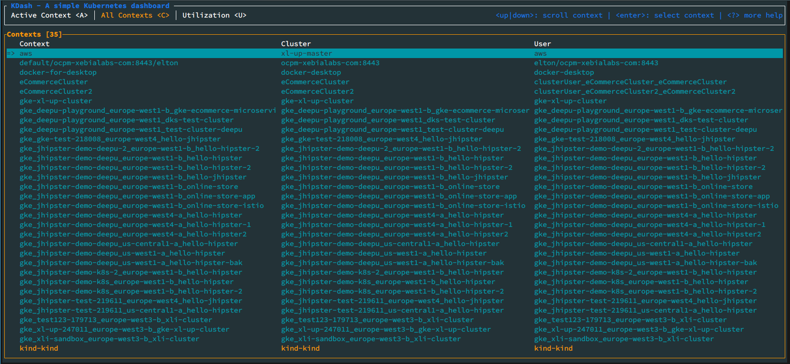

# KDash - A fast and simple dashboard for Kubernetes

**Note**: This is a beta version

```
 _  __ ___             _
| |/ /|   \  __ _  ___| |_
| ' < | |) |/ _` |(_-<| ' \
|_|\_\|___/ \__,_|/__/|_||_|
```

A simple terminal dashboard for Kubernetes built with Rust


## Installation

### Homebrew (Mac & Linux)

```
brew tap kdash-rs/kdash
brew install kdash

# If you need to be more specific, use:
brew install kdash-rs/kdash/kdash
```

### Install script

TODO

### Manual

Binaries for macOS, Linux and Windows are available on the [releases](https://github.com/kdash-rs/kdash/releases) page

### Docker

TODO

### Cargo

If you have Cargo installed then you install KDash from crates.io

```
cargo install kdash
```

You can also clone the repo and run `cargo run` or `make` to build and run the app

**Note:**: On Linux you might need to have package `xorg-dev` (Debian/Ubuntu) or `xorg-x11-server-devel` (Fedora) or equivalent installed for the copy to clipboard features to work

## USAGE:

Press `?` while running the app to see keybindings

## FLAGS:

- `-h, --help`: Prints help information
- `-V, --version`: Prints version information
- `-t, --tick-rate <tick-rate>`: Set the tick rate (milliseconds): the lower the number the higher the FPS.
- `-p, --poll-rate <poll-rate>`: Set the network call polling rate (milliseconds, should be multiples of tick-rate): the lower the number the higher the network calls.

## Features & Todos

- CLI Info
- Resource Watch (configurable polling interval with `-p` flag)
  - [x] Pods
  - [x] Nodes
  - [x] Namespace
  - [x] Services
  - [x] Containers
  - [x] ConfigMaps
  - [x] StatefulSets
  - [x] ReplicaSets
  - [x] Deployments
- Describe resources
  - [x] Pods
  - [x] Nodes
  - [ ] Services
  - [ ] Deployments
  - [ ] ConfigMaps
  - [ ] StatefulSets
  - [ ] ReplicaSets
  - [x] select/copy output
  - [ ] as YAML
- Stream logs/events
  - [x] Containers
  - [ ] Services
  - [ ] Deployments
  - [ ] StatefulSets
  - [x] select/copy output
- Context
  - [x] Context info
  - [x] Node metrics
  - [x] Context watch
  - [x] Change namespace?
  - [ ] Context switch
- [x] Resources utilizations
- [x] Dark/Light themes
- [ ] Custom keymap
- [ ] Custom theme
- [ ] Tests, a lot of them :)

## Screenshots

### Overview screen


### Container logs screen (light theme)


### Pod describe screen (light theme)


### Contexts screen



### Utilization screen


## Libraries used

- [tui-rs](https://github.com/fdehau/tui-rs)
- [clap](https://github.com/clap-rs/clap)
- [tokio](https://github.com/tokio-rs/tokio)
- [duct.rs](https://github.com/oconnor663/duct.rs)
- [kube-rs](https://github.com/clux/kube-rs)
- [serde](https://github.com/serde-rs/serde)
- [kubectl-view-allocations](https://github.com/davidB/kubectl-view-allocations)
- [rust-clipboard](https://github.com/aweinstock314/rust-clipboard)

## How does this compare to K9S?

[K9S](https://github.com/derailed/k9s) is a beast compared to this as it offers way more features including CRUD actions.

KDash only offers a view of most used resources with a focus on speed and UX. Hence the UI/UX is designed to be more user friendly and easier to navigate with contextual help everywhere and a tab system to switch between different resources easily.

At least for now there are no plans to add CRUD for resources

## Licence

MIT

## Authors

- [Deepu K Sasidharan](https://deepu.tech/)
