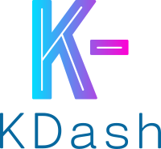
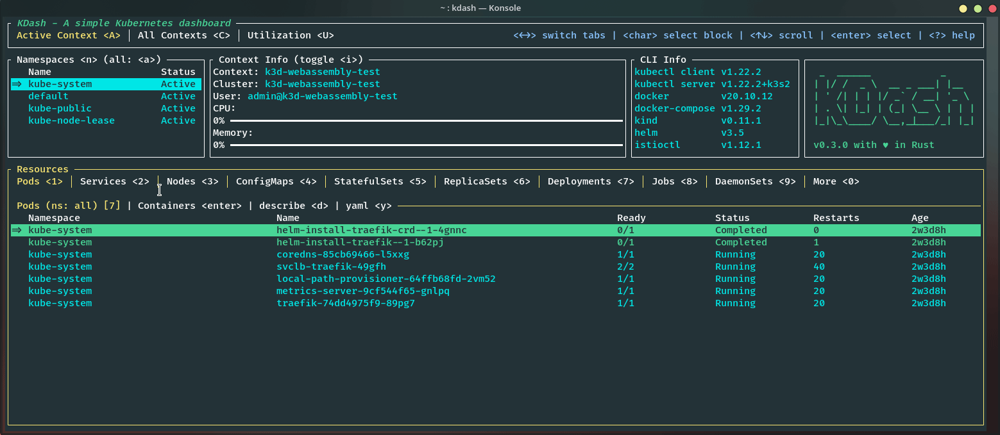
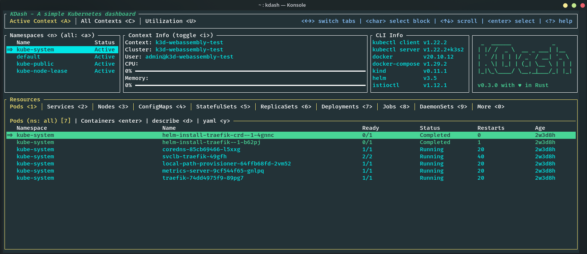
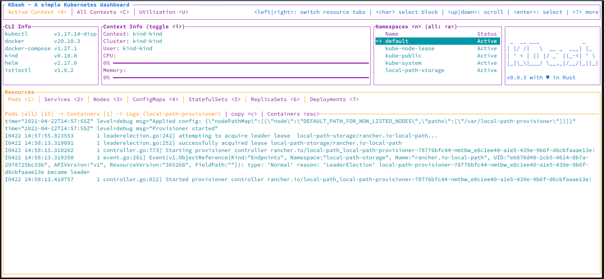
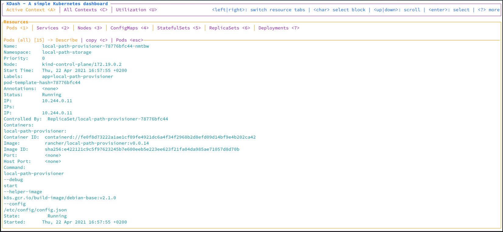

# KDash - A fast and simple dashboard for Kubernetes


[](https://crates.io/crates/kdash)


[](https://coveralls.io/github/kdash-rs/kdash?branch=main)
[](https://github.com/kdash-rs/kdash/releases)


[](https://twitter.com/intent/follow?screen_name=deepu105)



A simple terminal dashboard for Kubernetes built with Rust



## Installation

### Homebrew (Mac & Linux)

```bash
brew tap kdash-rs/kdash
brew install kdash

# If you need to be more specific, use:
brew install kdash-rs/kdash/kdash
```

To upgrade

```bash
brew upgrade kdash
```

### Scoop (Windows - Recommended way)

```bash
scoop bucket add kdash-bucket https://github.com/kdash-rs/scoop-kdash

scoop install kdash
```

### Chocolatey (Windows)

Choco package located [here](https://chocolatey.org/packages/kdash).
Since validation of the package takes forever, it may take a long while to become available after a release. I would recommend using Scoop instead for Windows.

```bash
choco install kdash

# Version number may be required for newer releases, if available:
choco install kdash --version=0.1.0
```

To upgrade

```bash
choco upgrade kdash --version=0.1.0
```

### Install script

Run the below command to install the latest binary. Run with sudo if you dont have write access to /usr/local/bin. Else the script will install to current directory

```sh
curl https://raw.githubusercontent.com/kdash-rs/kdash/main/deployment/getLatest.sh | bash
```

### Manual

Binaries for macOS, Linux and Windows are available on the [releases](https://github.com/kdash-rs/kdash/releases) page

1. Download the latest [binary](https://github.com/kdash-rs/kdash/releases) for your OS.
1. For Linux/macOS:
   1. `cd` to the file you just downloaded and run `tar -C /usr/local/bin -xzf downloaded-file-name`. Use sudo if required.
   1. Run with `kdash`
1. For Windows:
   1. Use 7-Zip or TarTool to unpack the tar file.
   1. Run the executable file `kdash.exe`

### Docker

Run KDash as a Docker container by mounting your `KUBECONFIG`. For example the below for default path

```bash
docker run --rm -it -v ~/.kube/config:/root/.kube/config deepu105/kdash
```

You can also clone this repo and run `make docker` to build a docker image locally and run it using above command

**Note**: This may not work properly if you run Kubernetes locally using Minikube or Kind

### Cargo

If you have Cargo installed then you install KDash from crates.io

>Note: On Debian/Ubuntu you also need to install `libxcb-xfixes0-dev` and `libxcb-shape0-dev`

```bash
cargo install kdash
```

You can also clone the repo and run `cargo run` or `make` to build and run the app

**Note:**: On Linux you might need to have package `xorg-dev` (Debian/Ubuntu) or `xorg-x11-server-devel` (Fedora) or equivalent installed for the copy to clipboard features to work

## USAGE:

```bash
kdash
```

Press `?` while running the app to see keybindings

## FLAGS:

- `-h, --help`: Prints help information
- `-V, --version`: Prints version information
- `-t, --tick-rate <tick-rate>`: Set the tick rate (milliseconds): the lower the number the higher the FPS.
- `-p, --poll-rate <poll-rate>`: Set the network call polling rate (milliseconds, should be multiples of tick-rate): the lower the number the higher the network calls.

## Limitations/Known issues

- [Windows] KDash looks better on CMD since Powershell's default theme makes the colours look weird.
- [Windows] If using k3d for local clusters, set the server URL to 127.0.0.1 as 0.0.0.0 doesn't work with kube-rs. You can use `k3d cluster create --api-port 127.0.0.1:6550` or change the `cluster.server` value in your `.kube/config` for the k3d cluster to `127.0.0.1:<port>`

## Features

- CLI Info
- Node metrics
- Resource Watch (configurable polling interval with `-p` flag)
- Describe resources & copy output
- Get YAML for resources & copy output
- Stream container logs
- Context
  - Context info
  - Context watch
  - Change namespace
  - Context switch
- Resources utilizations for nodes, pods and namespaces based on metrics server. Requires [metrics-server](https://kubernetes.io/docs/tasks/debug-application-cluster/resource-metrics-pipeline/#metrics-server) to be deployed on the cluster.
- Dark/Light themes

## Screenshots

### Overview screen



### Container logs screen (light theme)



### Pod describe screen (light theme)



### Contexts screen


### Utilization screen


## Libraries used

- [tui-rs](https://github.com/fdehau/tui-rs)
- [crossterm](https://github.com/crossterm-rs/crossterm)
- [clap](https://github.com/clap-rs/clap)
- [tokio](https://github.com/tokio-rs/tokio)
- [duct.rs](https://github.com/oconnor663/duct.rs)
- [kube-rs](https://github.com/clux/kube-rs)
- [serde](https://github.com/serde-rs/serde)
- [kubectl-view-allocations](https://github.com/davidB/kubectl-view-allocations)
- [rust-clipboard](https://github.com/aweinstock314/rust-clipboard)

## How does this compare to K9S?

[K9S](https://github.com/derailed/k9s) is a beast compared to this as it offers way more features including CRUD actions.

KDash only offers a view of most used resources with a focus on speed and UX. Really, if something is slow or have bad UX then please raise a bug. Hence the UI/UX is designed to be more user friendly and easier to navigate with contextual help everywhere and a tab system to switch between different resources easily.

At least for now there are no plans to add full CRUD for resources but we will add more resources and more useful actions

## Licence

MIT

## Authors

- [Deepu K Sasidharan](https://deepu.tech/)

## Contributors

- [Asha Somayajula](https://github.com/somayaj)
